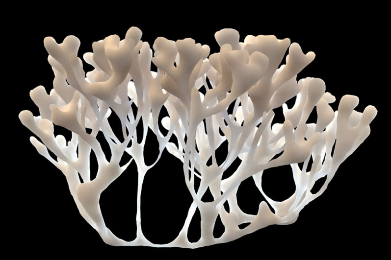

___
## MS Thesis In Digital Media

**NYU Tandon School of Engineering**

**Technology, Culture and Society**

**Integrated Digital Media**

Fall 2018 • 3 credit hrs

Instructor: Elizabeth Henaff, ehenaff@nyu.edu

Location: Tuesday 6-8:50 PM • MAGNET 811 

Office hours: Wednesdays 3pm-5pm or by appointment, MAGNET 874

Prerequisite: DM-GY 9963 MS Pre-Thesis in Digital Media: Research Methods

[FIND THE FULL COURSE MATERIALS WEBSITE HERE](https://idmnyu.github.io/MS-Thesis-Fall-2018/)

from [https://houdinigubbins.wordpress.com/2017/04/30/coral-growth/](https://houdinigubbins.wordpress.com/2017/04/30/coral-growth/)